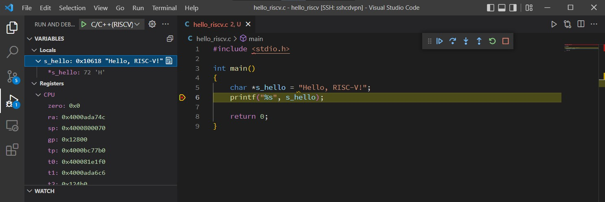

# RISC-V ❤ VS Code

To show you how to debug RISC-V program in VS Code.

There is a simple project with `.vscode`, including `launch.json` and `tasks.json`.

## Prerequisites

* riscv64-unknown-linux-gnu toolchain
* QEMU-6.2.0
* C/C++ VS Code extension

### In path

* riscv64-unknown-linux-gnu, toolchain
* qemu-riscv64, QEMU

### Modification

* `args` for `Run Qemu Server(RISC-V)` in `tasks.json`, `sysroot` to real path.
* All commands in `command` to real paths.
* `port`, i.e. 65501 in project, to custom one but the same in two json files.

## Getting Started

1. Copy configuration files in `.vscode` to your project and modify the paths.
2. Terminal -> Run Task -> C/C++(RISC-V): Build active file
3. Terminal -> Run Task -> Run Qemu Server(RISC-V)
4. F5 to start debugging

## Screenshot

## Authors

hi@xlindo.com

## License

This project is licensed under the GPLv2 - see the [LICENSE](LICENSE "LICENSE") file for details

